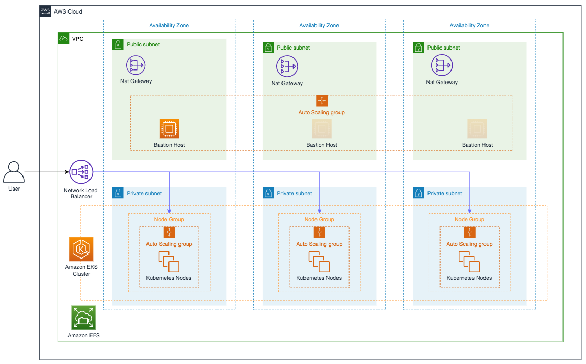

# Amazon Elastic Kubernetes Service - Boomi Molecule & Boomi Atom Cloud

--------------------------------------------------------------------------------------

## Architecture Overview
This reference architecture utilizes a containerized deployment in Amazon EKS - Managed Kubernetes Service to convey Boomi Molecule/Cloud Kubernetes configuration requirements.  The example architecture deploys an external load balanced, highly available, Kubernetes containerized Molecule/Cloud cluster with the ability to dynamically scale both cluster nodes and pods.



## Requirements
#### AWS CLI
AWS CLI installed and configured to use your AWS Credentials. More information can be found [here](https://docs.aws.amazon.com/eks/latest/userguide/getting-started-eksctl.html).

#### Kubernetes Version
The Boomi Molecule/Cloud and this reference architecture requires **Kubernetes version 1.16** or greater.

#### EKSCTL
This reference architecture requires the command-line utility **eksctl** to be installed for the example deployment.  Installation instructions can be found [here](https://docs.aws.amazon.com/eks/latest/userguide/getting-started-eksctl.html).

#### KUBECTL
This reference architecture requires the Kubernetes command-line utility **kubectl** to be installed for the example deployment.  Installation instructions can be found [here](https://docs.aws.amazon.com/eks/latest/userguide/getting-started-eksctl.html).

#### Kubernetes Configuration
The following Kubernetes configuration requirements are needed to successfully run a Boomi Elastic Molecule or Atom Cloud in a Kubernetes cluster. Further details about these configuration components are outlined under the [Configuration Review & Deployment](#markdown-header-configuration-review-deployment) section of this document. It is important for a user to familiarize themselves with the functionality of each requirement before proceeding. 

* [Kubernetes Cluster](https://kubernetes.io/docs/concepts/overview/components/)
* [Node(s)](https://kubernetes.io/docs/concepts/architecture/nodes/)
* [Kubernetes Secrets](https://kubernetes.io/docs/concepts/configuration/secret/)
* [Kubernetes Service](https://kubernetes.io/docs/concepts/services-networking/service/)
* [Storage Class](https://kubernetes.io/docs/concepts/storage/storage-classes/)
* [Persistent Volume](https://kubernetes.io/docs/concepts/storage/persistent-volumes/)
* [Persistent Volume Claim](https://kubernetes.io/docs/concepts/storage/persistent-volumes/)
* [Stateful Set](https://kubernetes.io/docs/concepts/workloads/controllers/statefulset/)
    * The most impactful Kubernetes configuration requirement for a Boomi Molecule/Cloud is the StatefulSet.  StatefulSets require configuration consideration to effectively utilize AWS autoscaling functions with multiple Availability Zones (AZ) to achieve High Availability (HA) and system resiliency.

--------------------------------------------------------------------------------------

## Recommendations
Below are Kubernetes configuration recommendations for value added Kubernetes functions.

#### Kubernetes Configuration
**Autoscaling**  
The Boomi Molecule/Cloud shows its true power through its elastic capabilities. Although it is possible to deploy the Boomi Molecule/Cloud in a Kubernetes containerized environment without taking advantage of elasticity, it is highly recommended that users do so by deploying the following items:

* [Cluster Autoscaler](https://github.com/kubernetes/autoscaler/blob/master/cluster-autoscaler/cloudprovider/aws/README.md)
* [Metrics Server](https://kubernetes.io/docs/tasks/debug-application-cluster/resource-metrics-pipeline/#metrics-server)
* [Horizontal Pod Autoscaler (HPA)](https://kubernetes.io/docs/tasks/run-application/horizontal-pod-autoscale/)

--------------------------------------------------------------------------------------
## Configuration Review & Deployment
The following configuration component files each represent a critical component in the example containerized stack, and are explained in depth later in this document. Note: You may rename these as appropriate if implementing a Boomi Atom Cloud.

* boomi_molecule_eks_cluster.yaml
* boomi_molecule_eks_storageclass.yaml
* boomi_molecule_eks_pv.yaml
* boomi_molecule_eks_pvclaim.yaml
* boomi_molecule_eks_secret.yaml
* boomi_molecule_eks_service.yaml
* boomi_molecule_eks_statefulset.yaml
* boomi_molecule_eks_ca.yaml
* k8s_metrics_server_install.sh
* boomi_molecule_eks_hpa.yaml

--------------------------------------------------------------------------------------
#### Kubernetes Cluster & Node(s)
In the [boomi_molecule_eks_cluster.yaml](boomi_molecule_eks_cluster.yaml) configuration file, we define the target cluster and required node groups for deployment.

The EKS cluster and node groups are created using the following eksctl command:
```
$ eksctl create cluster -f boomi_molecule_eks_cluster.yaml
```
Note that this command takes a considerable amount of time to execute the Cloud Formation Template. You can view the cluster status in the EKS Admin Console. Upon completion, you can view the EKS cluster, and inspect that the 3 EC2 instances are in a running state. Note that the EC2 instances do not have public IP’s by default. The recommendation is to use a Bastion host, as specified later in this article.
Expected return:
```
[✔]  EKS cluster "EKS-boomi-molecule-main" in "us-east-1" region is ready
```

--------------------------------------------------------------------------------------
#### Create the required NFS for the Boomi Molecule/Cloud
The Boomi Molecule/Cloud requires the provisioning and availability of a Network File System (NFS).  In the deployment example, we will utilize [**Amazon's Elastic File System (EFS)**](https://docs.aws.amazon.com/efs/latest/ug/whatisefs.html) to meet this requirement.
).

The [AWS EFS Container Storage Interface](https://github.com/kubernetes-sigs/aws-efs-csi-driver) (CSI) driver must be deployed to the Cluster to integrate with the created Amazon EFS.  The driver is referenced by the Storage Class, and Persistent Volume configuration files.

The EFS CSI is deployed to the Cluster using the following kubectl command:
```
$ kubectl apply -k "github.com/kubernetes-sigs/aws-efs-csi-driver/deploy/kubernetes/overlays/stable/?ref=master"
```

Create EFS:
Use the following commands to create Amazon EFS

```
vpc_id=$(aws eks describe-cluster \
    --name boomi-aws \
    --query "cluster.resourcesVpcConfig.vpcId" \
    --output text)

cidr_range=$(aws ec2 describe-vpcs \
    --vpc-ids $vpc_id \
    --query "Vpcs[].CidrBlock" \
    --output text)

security_group_id=$(aws ec2 create-security-group \
    --group-name boomiEfsSecurityGroup \
    --description "Security group used for Boomi EFS" \
    --vpc-id $vpc_id \
    --output text)

aws ec2 authorize-security-group-ingress \
    --group-id $security_group_id \
    --protocol tcp \
    --port 2049 \
    --cidr $cidr_range

file_system_id=$(aws efs create-file-system \
    --region us-east-1 \
    --tags Key=name,Value=boomi-efs \
    --performance-mode generalPurpose \
    --query 'FileSystemId' \
    --output text)

subnets=$(aws ec2 describe-subnets \
            --filters "Name=vpc-id,Values=$vpc_id" \
            --query 'Subnets[*].{SubnetId: SubnetId,AvailabilityZone: AvailabilityZone,CidrBlock: CidrBlock}' \
            | jq -r '. | .[] | .SubnetId')

for subnet in ${subnets[@]}
do
    echo "creating mount target in " $subnet
    aws efs create-mount-target --file-system-id $file_system_id --subnet-id $subnet --security-groups $security_group_id
done

```

--------------------------------------------------------------------------------------
#### Create StorageClass

The Storage Class is defined in the [boomi_molecule_eks_storageclass.yaml](boomi_molecule_eks_storageclass.yaml) configuration file.
The StorageClass is deployed to the created Cluster using the following kubectl CLI command:
```
$ kubectl apply -f  boomi_molecule_eks_storageclass.yaml
```

Expected return:
```
storageclass.storage.k8s.io/efs-sc created
```

--------------------------------------------------------------------------------------
#### Create PersistentVolume
The PV is bound to the external NFS created previously.  The required PV is defined in the [boomi_molecule_eks_pv.yaml](boomi_molecule_eks_pv.yaml) configuration file.

* This value should be configured for your specific storage requirements.

```
spec.csi.volumeHandle: <efs_file_system_id>
```
* The EFS file system ID from the previous Amazon EFS creation step is required.

The PersistentVolume is deployed to the created Cluster using the following kubectl CLI command:
```
$ kubectl apply -f  boomi_molecule_eks_pv.yaml
```

Expected return:
```
persistentvolume/nfs-pv created
```

--------------------------------------------------------------------------------------
#### Create PersistentVolumeClaim
The required PVC is defined in the [boomi_molecule_eks_pvclaim.yaml](boomi_molecule_eks_pvclaim.yaml) configuration file and is later referenced in the StatefulSet configuration.

* This value should be configured for your specific storage requirements and should match the value delineated in the boomi_molecule_eks_pv.yaml.

The PersistentVolumeClaim is deployed to the Cluster using the following kubectl CLI command:
```
$ kubectl apply -f  boomi_molecule_eks_pvclaim.yaml
```

Expected return:
```
persistentvolumeclaim/nfs-claim created
```

--------------------------------------------------------------------------------------
#### Create Kubernetes Secret

The Boomi Molecule/Cloud Docker image expects a number of environment variables passed during container creation.  Boomi Account_ID, Username, and Password are expected variables that represent sensitive information.  The example deployment utilizes a Kubernetes Secret to provide access to sensitive information rather than putting it verbatim in a Pod definition.  The Kubernetes Secret is defined in the [boomi_molecule_eks_secret.yaml](boomi_molecule_eks_secret.yaml).
```
apiVersion: v1
kind: Secret
metadata:
  name: boomi-secret
type: Opaque
stringData:
  username: **************************
  password: **************************
  account: *************************
```

The Secret is deployed to the Cluster using the following kubectl CLI command:
```
$ kubectl apply -f  boomi_molecule_eks_secret.yaml
```
Expected return:
```
secret/boomi-secret created
```

--------------------------------------------------------------------------------------
#### Create Service
The required Kubernetes Service is defined in the [boomi_molecule_eks_service.yaml](boomi_molecule_eks_service.yaml) configuration file.

```
metadata.annotations.service.beta.kubernetes.io/aws-load-balancer-type:"nlb"
```
* This annotation directs the creation of a Network Load Balancer (NLB) when the service is deployed with type: LoadBalancer.

The Service is deployed to the created Cluster using the following kubectl CLI command:
```
$ kubectl apply -f  boomi_molecule_eks_service.yaml
```
Expected return:
```
service/molecule-service created
```

--------------------------------------------------------------------------------------
#### Create StatefulSet

The Stateful Set is defined in the [boomi_molecule_eks_statefulset.yaml](boomi_molecule_eks_statefulset.yaml).  This configuration file details a number of critical elements and ties together all previous configuration components into deployed Pods.

```
spec.template.spec.terminationGracePeriodSeconds: 900
```
* Duration in seconds the pod needs to terminate gracefully after the PreStop hook is called.  This number should be greater than the Molecule setting for com.boomi.container.elasticity.forceRestartOverride.  More information on the setting can be found [here](https://help.boomi.com/bundle/integration/page/r-atm-Properties_panel_Advanced_tab.html).


The Stateful Set is deployed to the Cluster using the following kubectl CLI command:
```
$ kubectl apply -f  boomi_molecule_eks_statefulset.yaml
```

Expected return:
```
statefulset.apps/molecule created
```

--------------------------------------------------------------------------------------
## Recommended Deployment Additions - Autoscaling

In the [boomi_molecule_eks_ca.yaml](boomi_molecule_eks_ca.yaml) configuration file we define and deploy the Cluster Autoscaler.  A large majority of the configuration sets up the correct ServiceAccount, Roles and RBAC allocations required by the Cluster Autoscaler.  Critical parameters associated with scaling behavior are found in the Deployment document (kind: Deployment), inside the element. ```spec.template.spec.containers.command:```.

The Cluster Autoscaler is deployed to the created Cluster using the following kubectl CLI command:
```
$ kubectl apply -f boomi_molecule_eks_ca.yaml
```

Expected return:
```
serviceaccount/cluster-autoscaler created
clusterrole.rbac.authorization.k8s.io/cluster-autoscaler created
role.rbac.authorization.k8s.io/cluster-autoscaler created
clusterrolebinding.rbac.authorization.k8s.io/cluster-autoscaler created
rolebinding.rbac.authorization.k8s.io/cluster-autoscaler created
deployment.apps/cluster-autoscaler created
```

--------------------------------------------------------------------------------------
#### Deploy the Kubernetes Metrics Server

The Metrics Server is a required component to deploy the HPA addressed later in this document.  The [k8s_metric_server_install.sh](https://bitbucket.org/officialboomi/runtime-containers/src/master/eks/config/k8s_metrics_server_install.sh) file is a simple bash script that automates the download and deployment of the most current version of the Metrics Server.


Expected return:
```
clusterrole.rbac.authorization.k8s.io/system:aggregated-metrics-reader created
clusterrolebinding.rbac.authorization.k8s.io/metrics-server:system:auth-delegator created
rolebinding.rbac.authorization.k8s.io/metrics-server-auth-reader created
apiservice.apiregistration.k8s.io/v1beta1.metrics.k8s.io created
serviceaccount/metrics-server created
deployment.apps/metrics-server created
service/metrics-server created
clusterrole.rbac.authorization.k8s.io/system:metrics-server created
clusterrolebinding.rbac.authorization.k8s.io/system:metrics-server created
```


--------------------------------------------------------------------------------------
#### Deploy Horizontal Pod Autoscaler (HPA) 

The HPA is described in the [boomi_molecule_eks_hpa.yaml](boomi_molecule_eks_hpa.yaml) configuration file.  The HPA is the initial catalyst for all autoscaling events inside the Cluster.

The HPA is deployed to the Cluster using the following kubectl CLI command:
```
$kubectl apply -f boomi_molecule_eks_hpa.yaml --validate=false
```

Expected return:
```
horizontalpodautoscaler.autoscaling/molecule-hpa created
```

--------------------------------------------------------------------------------------

##### Useful kubectl CLI Commands
Below are some helpful kubectl and CLI commands to see Pod metrics, HPA events, Cluster Node metrics and CA events.

**Pod specific:**
HPA state
```
kubectl get hpa -w
```

Pod status/scaling
```
kubectl get pods -w -l app=molecule
```

Pod resource usage
```
watch kubectl top pods
```

**Cluster Node specific:**
CA log
```
kubectl -n kube-system logs -f deployment.apps/cluster-autoscaler
```

Cluster Node resource usage
```
watch kubectl top nodes
```

Cluster Node status/Scaling
```
watch kubectl get nodes
```

Another good command that shows what Pods are on which Cluster Node:
```
kubectl get pod -o=custom-columns=NAME:.metadata.name,STATUS:.status.phase,NODE:.spec.nodeName
```
